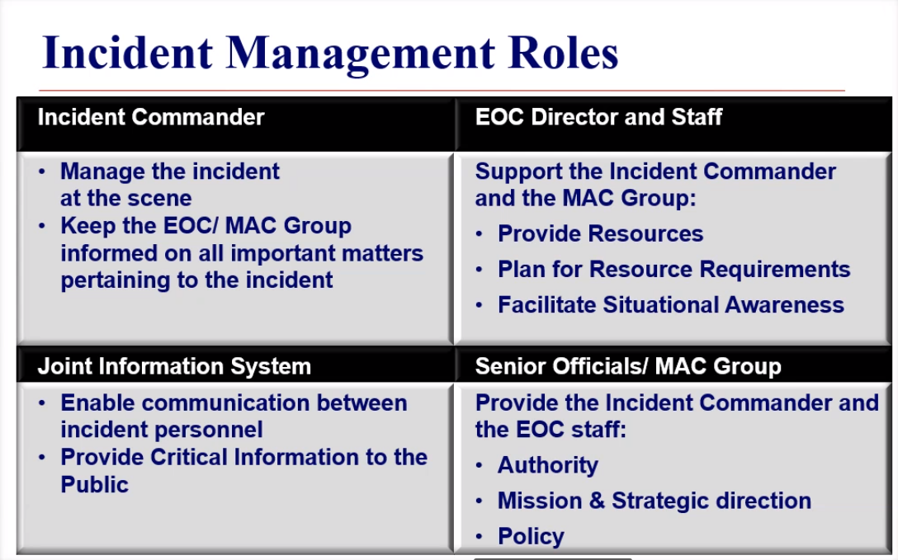
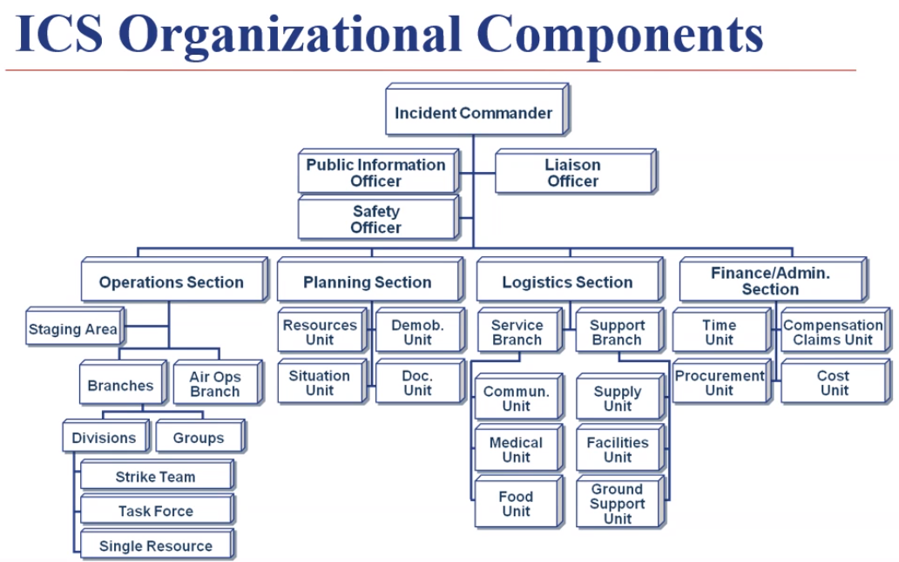
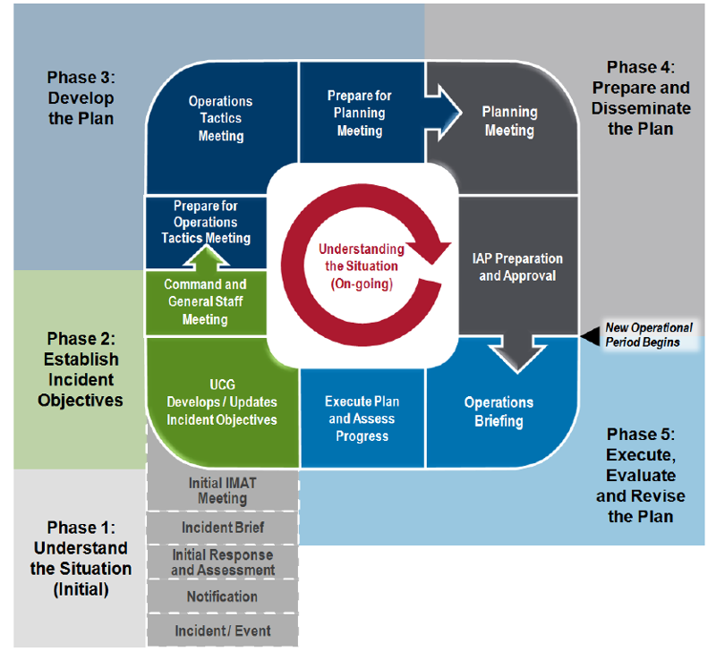

# ICS 300

## Questions Missed on Pre-test
- Unified Command organization: shares facilities and coordinates a process for resource
- Before establishing strategies or executing tactics, what must be developed? Incident Objectives
- In what meeting are the proposed incident strategies and tactics developed by
  the Operations Section? Tactics meeting
- During what meeting is the final opportunity to validate the Operational Plan
  and resources as proposed by the Operations Section Chief? Planning meeting
- What is the purpose of the Operations Briefing? present IAP to supervisors of tactical resources.
- When ordering resources, what type of ordering places a heavier load on
  incident personnel by requiring them to place orders through two or more
  ordering points? Multipoint Ordering
- With whom or what should the Incident Commander consult when demobilizing
  resources to ensure proper release? Agency Protocols
- 

## Review
- Common incident facilities and locations
- Unity of Command - 1 boss
- Integrated Communications -
- Unified Command - 

---

### Staff

Command Staff - PIO Safety and Liason

General Staff - Ops Planning Logistics and Finance

FLOP - Finance Logistics Operations and Planning

- Branches -- Numbered (roman numerals)
- Divisions -- Geographic (think Div ABCD from Fire)
- Groups are Functional
- Strike Team -- all the same
- Task Force -- bunch of different resources (each may have boss)

- Everything under operations is a "tactical" operation

---

